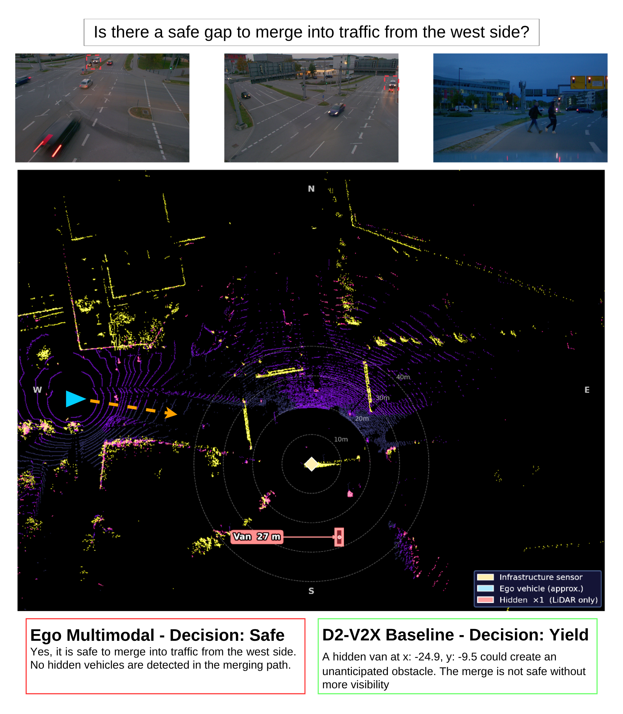

# D2-V2X: Depth-Driven Cooperative V2X Reasoning for Autonomous Driving
Official implementation of "D2-V2X: Depth-Driven Cooperative V2X Reasoning for Autonomous Driving", accepted to the CVPR 2026 DriveX Workshop

## Quick Links:
- Paper: [](https://arxiv.org/abs/)
- Dataset (🤗):  [D2-V2X QRA Dataset](https://huggingface.co/datasets/kr301/d2v2x-qra)
- Model Weights (🤗): [D2-V2X Model Weights](https://huggingface.co/kr301/d2v2x-adapter)

## 🚀 Overview
D2-V2X is a spatially-aware Question-Rationale-Answer (QRA) benchmark designed to move Vision-Language Models (VLMs) beyond simple perception into cooperative, reasoned decision-making. D2-V2X provides a unified multimodal framework that leverages 3D LiDAR, cooperative V2X infrastructure, and Chain-of-Thought (CoT) reasoning to address the constraint of sensor occlusions in autonomous driving.



Key Features:
- **Dataset**: 8,500 multimodal QRA triplets grounded in the TUMTraf-V2X universe.
- **Reasoning**: Explicit Chain-of-Thought (CoT) rationales that force models to articulate spatial relationships before making a maneuver decision.
- **Baseline Architecture**: A parameter-efficient adapter aligning 3D LiDAR voxel features with the VLM latent space.

## 📁 Repository Structure
```
.
├── data_pipeline/       # Dataset and collator implementations
├── models/              # Adapter and model architecture
├── qwen/                # Updated Qwen files
├── utils/               # Utility scripts for data processing
├── train.py             # Train model on the dataset
├── evaluate.py          # Evaluate model on the dataset
├── requirements.txt     # Requirements for environment setup
└── README.md
```

## Getting Started
### Installation
```
git clone https://github.com/KevinRichard1/D2-V2X.git
cd D2-V2X
pip install -r requirements.txt
```

### Usage
```
# To train the model:
python train.py \
    --qwen_path="/path/to/qwen/model" \
    --train_path="/path/to/train/dataset" \
    --val_path="/path/to/val/dataset" \
    --img_path="/path/to/images" \
    --train_feature_path="/path/to/train/lidar/features" \
    --val_feature_path="/path/to/val/lidar/features" \
    --output_path="/checkpoint/path" \
    --mode="" \
    --stage="" \
    --lr=2e-5 \
    --epochs=3 \
    --batch_size=1 \
    --accum_steps=64

# To evaluate the model
python evaluate.py \
    --qwen_path="/path/to/qwen/model" \
    --checkpoint_path="/checkpoint/path" \
    --inference \
    --evaluate \
    --mode="" \
    --json_path="/path/to/test/dataset" \
    --img_path="/path/to/images" \
    --test_feature_path="/path/to/test/lidar/features" \
    --inference_save_path="results.json" \
```

## ✍️ Citation
If you find our work useful, please cite:
```

```

## Acknowledgements
We thank the creators of the TUMTraf-V2X dataset and the Qwen3-VL model.
